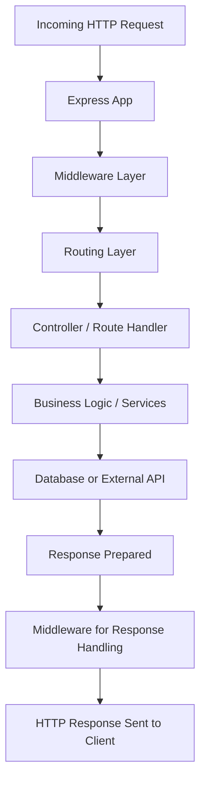

# Express.js

## Overview
- **Express.js** is a minimal and flexible Node.js web application framework.
- It provides a robust set of features for building **web applications and APIs**.
- Widely used in the Node.js ecosystem for server-side development.
- True: Express is **heavily used for Node.js APIs** due to its simplicity, scalability, and extensive middleware ecosystem.

## Key Features
- Fast and lightweight
- Middleware support for handling requests, responses, and routing
- Routing system for defining endpoints
- Integration with templating engines (like Pug, EJS)
- Error handling mechanisms
- Easy integration with databases and external services

## Common Use Cases
- RESTful APIs
- Single Page Applications (SPA) backend
- Microservices
- Prototyping and MVP development

## Typical Folder Structure
A common Express project structure looks like this:

my-express-app/
├── node_modules/       # Installed npm packages
├── src/
│   ├── controllers/    # Route handlers and business logic
│   ├── routes/         # API endpoint definitions
│   ├── middleware/     # Custom middleware functions
│   ├── models/         # Database models or schemas
│   ├── services/       # Reusable service logic
│   ├── utils/          # Helper functions
│   └── app.js          # Main Express app setup
├── tests/              # Unit and integration tests
├── package.json        # Project metadata and dependencies
├── .env                # Environment variables
└── README.md           # Project documentation

## Best Practices
- Keep routes, controllers, and business logic separate for maintainability.
- Use environment variables for configuration (`dotenv` package).
- Employ middleware for logging, authentication, and error handling.
- Use proper HTTP status codes for API responses.
- Modularize code for scalability (e.g., separate modules for routes and services).

## Popular Middleware Examples
- `body-parser` – Parse incoming request bodies
- `cors` – Enable Cross-Origin Resource Sharing
- `morgan` – HTTP request logging
- `helmet` – Security headers
- `express-validator` – Input validation

## Resources
- [Official Documentation](https://expressjs.com/)
- [Express GitHub Repository](https://github.com/expressjs/express)

## Code Flow Diagram

# Best Practices
* **Separate Concerns**: Keep routes, controllers, and business logic separate for maintainability and a clean codebase.
* **Environment Variables**: Use environment variables for sensitive information and configuration settings. The `dotenv` package is a common tool for this.
* **Middleware**: Employ middleware for tasks that apply to multiple routes, such as logging, authentication, and error handling.
* **HTTP Status Codes**: Use appropriate HTTP status codes to provide clear feedback on API responses (e.g., `200 OK`, `404 Not Found`, `500 Internal Server Error`).
* **Modularize Code**: Break down your application into smaller, reusable modules (e.g., separate files for routes, services, and utilities) to improve scalability and organization.

---

# Popular Middleware Examples
* **body-parser**: Parses incoming request bodies in a middleware before your handlers, available under the `req.body` property.
* **cors**: Enables **Cross-Origin Resource Sharing**, allowing or restricting requests from different domains.
* **morgan**: A popular HTTP request logger that provides detailed logging of requests to the console.
* **helmet**: A collection of middleware functions that set various HTTP headers to help secure your Express app.
* **express-validator**: A set of express.js middlewares that wraps validator.js for server-side input validation.

