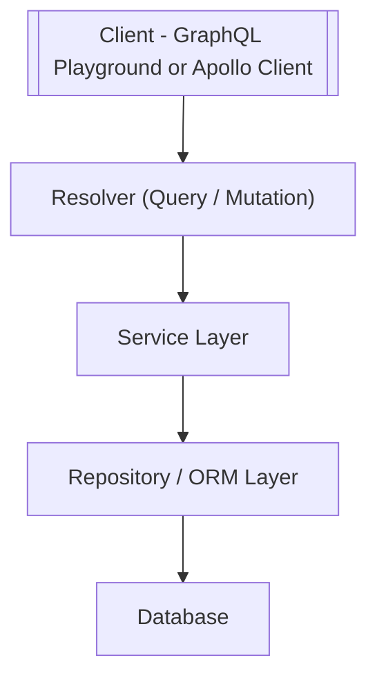

# NestJS Overview for Node Server Side Apps - APIs

**NestJS** is a progressive Node.js framework for building efficient, scalable, and maintainable server-side applications. It uses **TypeScript** by default and is heavily inspired by Angular’s architecture, making it ideal for teams familiar with Angular.

---

## 🔹 Overview

* Built on **Express** (default) or **Fastify** for high-performance APIs.
* Supports **REST**, **GraphQL**, **WebSockets**, and **microservices**.
* Uses **decorators**, **modules**, **controllers**, and **providers** for structure.
* Integrated **dependency injection (DI)** and **middleware** support.

---

## 🔹 Common Uses

* Backend for **Angular, React, or Vue SPAs**.
* **Microservices architecture** with message brokers like RabbitMQ, Kafka.
* **GraphQL APIs** for flexible queries.
* **Authentication/Authorization endpoints** (JWT, OAuth2).
* **Server-side rendering (SSR)** with Angular Universal.

---

## 🔹 Common Architectural Patterns

* **Dependency Injection (DI)**

  * Core to NestJS; allows modular and testable code.
* **Module-Based Architecture**

  * Organizes features and dependencies into separate modules.
* **Controller-Service-Repository Pattern**

  * Controllers handle HTTP requests; services contain business logic; repositories handle database access.
* **Factory Providers**

  * Create objects dynamically and manage complex dependency initialization.
* **Middleware & Interceptors**

  * Middleware: pre-processing requests.
  * Interceptors: modify responses or handle cross-cutting concerns (logging, caching).

---

## 🔹 Resolvers in NestJS

Resolvers are a key part of building **GraphQL APIs** with NestJS. They act like **controllers** in REST — mapping incoming GraphQL queries, mutations, and subscriptions to the appropriate service logic.

### ✨ How They Work
* **Queries** → Handle read operations (fetching data).
* **Mutations** → Handle write operations (create, update, delete).
* **Subscriptions** → Handle real-time data via WebSockets.

Resolvers use **decorators** such as:
* `@Resolver()` → Defines a resolver for a specific GraphQL type.
* `@Query()` → Maps to a GraphQL query.
* `@Mutation()` → Maps to a GraphQL mutation.
* `@Subscription()` → Maps to a GraphQL subscription.
* `@ResolveField()` → Resolves relationships or computed fields.

---

### 📂 Folder Structure with Resolvers
When using GraphQL, the module folder typically looks like this:

/src
└── modules
    └── users
        ├── users.resolver.ts   # Handles GraphQL queries and mutations for users. It acts as the entry point for API requests, routing them to the appropriate service.
        ├── users.service.ts    # Contains the core business logic for user-related operations, such as creating, updating, and retrieving user data.
        ├── users.module.ts     # Defines the module, bundling the resolver, service, and other components together.
        └── dto/
            ├── create-user.input.ts # A Data Transfer Object (DTO) for the data required to create a new user.
            ├── update-user.input.ts # A DTO for the data required to update an existing user.
            └── user.output.ts       # A DTO that defines the structure of the data returned for a user.

### 🔄 Code Flow with Resolvers


* Client executes a GraphQL query or mutation.
* Resolver delegates logic to a **service**.
* Service calls repository/ORM for database access.
* Database result flows back through the resolver to the client.

---

### ✅ Why Use Resolvers?
* **Flexible queries**: Clients can request exactly what they need.
* **Strong typing**: Aligns with TypeScript and GraphQL schemas.
* **Separation of concerns**: Resolvers stay thin, delegating logic to services.
* **Real-time support**: Subscriptions allow live updates (e.g., chat apps, dashboards).


## 🔹 Best Practices for Folder Structure

```
/src
│  main.ts
│  app.module.ts
│
├─ modules
│   ├─ users
│   │   ├─ users.controller.ts
│   │   ├─ users.service.ts
│   │   ├─ users.module.ts
│   │   └─ dto
│   │       └─ create-user.dto.ts
│   └─ auth
│       ├─ auth.controller.ts
│       ├─ auth.service.ts
│       └─ auth.module.ts
│
├─ common
│   ├─ filters
│   ├─ interceptors
│   └─ guards
│
├─ database
│   └─ prisma.service.ts
│
└─ config
    └─ configuration.ts
```

* **Modules** → Encapsulate features.
* **Controllers** → Handle HTTP routes.
* **Services** → Business logic.
* **DTOs** → Data transfer objects.
* **Common** → Guards, filters, interceptors.
* **Database** → ORM service (Prisma, TypeORM, Sequelize).

---

## 🔹 Code Flow Diagram

```
[ Client (Angular) ]
        |
        v
[ Controller ]
        |
        v
[ Service Layer ]
        |
        v
[ Repository / ORM Layer ]
        |
        v
[ Database (PostgreSQL / MySQL / MongoDB) ]
```

* Client sends HTTP requests.
* Controller validates requests and calls service.
* Service contains business logic and calls repository/ORM.
* Repository interacts with the database.
* Response returns back through the same path.

---

## 🔹 Why It's Popular

* **Familiar Angular-like architecture** → Easier for Angular developers.
* **TypeScript by default** → Type safety and modern JS features.
* **Highly modular and testable** → Encourages best practices.
* **Flexible** → REST, GraphQL, WebSockets, microservices.
* **Integration-ready** → Works with Prisma, TypeORM, MongoDB, RabbitMQ, Kafka, and more.
* **Active community and ecosystem** → Lots of tutorials, plugins, and Nest modules.

---

## 🔹 Additional Helpful Sections

* **Testing** → Unit tests with Jest; e2e tests with Supertest.
* **Logging & Monitoring** → Use built-in Logger or integrations like Winston.
* **Validation** → Use class-validator and DTOs.
* **Error Handling** → Global exception filters.
* **Security** → JWT, Passport.js, Guards, rate limiting.

---

## 🔹 Summary

NestJS is a modern, scalable framework for Node.js backend applications, ideal for teams building SPAs with typescript frontend frameworks like Next; React; Vue & Angular. Its architecture encourages modularity, dependency injection, and maintainability. It integrates well with databases, microservices, and cloud platforms, making it a strong choice for enterprise-level web applications.
