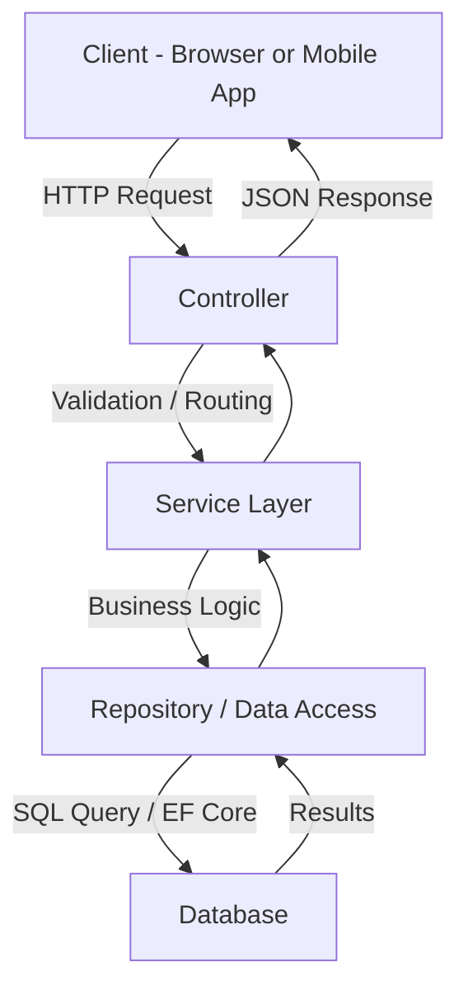

# APIs/webapi-csharp.md

# C# Web API Overview

**C# Web API** (ASP.NET Core Web API) is a widely used framework for building RESTful APIs in the .NET ecosystem. It enables developers to expose backend logic and data to clients such as Angular, React, or mobile apps.

---

## 🔹 Overview

* Part of **ASP.NET Core**, fully cross-platform and open-source.
* Allows building **RESTful APIs** with JSON, XML, or other formats.
* Integrates with **Entity Framework Core** for database access.
* Supports **middleware**, **dependency injection**, **logging**, **authentication**, and **authorization** out of the box.

---

## 🔹 Common Uses

* Backend services for **single-page applications (SPA)** like Angular or React.
* **Microservices** architecture for scalable distributed systems.
* **Serverless APIs** via Azure Functions or AWS Lambda (.NET support).
* Integration with **databases** (SQL Server, PostgreSQL, MySQL) or **external APIs**.
* **Authentication & Authorization** endpoints (JWT, OAuth, OpenID Connect).

---

## C# Web API Flow (ASP.NET Core)

> 🔑 **Explanation:**

- **Client** calls an endpoint (e.g., `GET /api/users`).
- **Controller** handles the request and delegates work.
- **Service Layer** applies business logic.
- **Repository/Data Access** talks to the database (via EF Core, Dapper, or raw SQL).
- **Response** flows back up the chain as JSON to the client.

---

## 🔹 Common Architectural Patterns

* **Dependency Injection (DI)**

  * Core to ASP.NET Core; inject services instead of hard-coding dependencies.
* **Repository Pattern**

  * Abstracts data access logic from business logic.
* **Unit of Work Pattern**

  * Ensures atomic operations across multiple repositories.
* **Factory Pattern**

  * Creates objects without exposing instantiation logic.
* **Mediator / CQRS**

  * Decouples commands/queries from handling logic for complex applications.
* **Middleware Pipeline**

  * Handles request/response processing (logging, authentication, error handling).

---

## 🔹 Best Practices for Folder Structure

```
/MyWebApi
│  Program.cs
│  Startup.cs
│  appsettings.json
│
├─ Controllers
│   └─ WeatherForecastController.cs
│
├─ Models
│   └─ WeatherForecast.cs
│
├─ Services
│   └─ WeatherService.cs
│
├─ Repositories
│   └─ WeatherRepository.cs
│
├─ Data
│   └─ AppDbContext.cs
│
├─ DTOs
│   └─ WeatherForecastDto.cs
│
├─ Mappings
│   └─ AutoMapperProfiles.cs
│
└─ Middleware
    └─ ExceptionMiddleware.cs
```

* **Controllers** → Handle HTTP requests.
* **Services** → Business logic.
* **Repositories** → Data access.
* **DTOs** → Data transfer objects.
* **Middleware** → Cross-cutting concerns (logging, error handling).

---

## 🔹 Code Flow Diagram

```
[ Client (Angular) ]
        |
        v
[ Controller ]
        |
        v
[ Service Layer ]
        |
        v
[ Repository / DbContext ]
        |
        v
[ Database (SQL Server / RDS / Cosmos) ]
```

* Client sends HTTP requests.
* Controller validates and forwards requests.
* Service layer contains business logic.
* Repository interacts with database.
* Response is returned through the same path back to the client.

---

## 🔹 Why It's Popular

* **Performance**: ASP.NET Core is lightweight and high-performance.
* **Cross-Platform**: Runs on Windows, Linux, and macOS.
* **Ecosystem**: Rich libraries, tooling (Visual Studio, VS Code), and strong community.
* **Security**: Built-in support for authentication, authorization, and secure headers.
* **Maintainability**: Encourages clean architecture, DI, and modular design.
* **Integration**: Works seamlessly with Azure, AWS, and various databases.

---

## 🔹 Additional Helpful Sections

* **Testing**: Unit tests with xUnit, integration tests with TestServer.
* **Logging & Monitoring**: Use Serilog, NLog, or Application Insights.
* **Versioning**: API versioning strategies (URL, header, query param).
* **Error Handling**: Centralized exception handling via middleware.

---
### High-Level Steps: .NET Core Web API with DTOs & EF Core
1. Set up the development environment (install .NET SDK, IDE, optional Postman/Swagger).
2. Create a new Web API project (dotnet new webapi -n MyWebApi).
3. Install EF Core packages for your database provider.
4. Define project structure (Controllers, Models, DTOs, Services, Data, Repositories, appsettings.json, Program.cs).
5. Create EF Core models (entities).
6. Create DTOs for requests and responses.
7. Create DbContext and configure connection string.
8. Create service/repository layer to handle business logic and map DTOs ↔ entities.
9. Create controllers that accept and return DTOs, injecting services.
10. Configure dependency injection and middleware in Program.cs.
11. Apply EF Core migrations to create the database and tables.
12. Test the API using Swagger, Postman, or curl.
13. Optional enhancements: authentication, validation, logging, exception handling, API versioning.

---

### Implementation Summary with a little more detail: 
 This guide outlines the high-level steps to create a .NET Core Web API using Data Transfer Objects (DTOs) and Entity Framework (EF) Core for data access. The steps include setting up the environment, structuring the project, implementing core components, and testing the API.

## 1. Set Up the Development Environment
- Install the **.NET SDK** from the official Microsoft website.
- Choose an IDE: **Visual Studio**, **VS Code**, or **JetBrains Rider**.
- Optionally, install **Postman** or use **Swagger UI** (included with the Web API template) for API testing.

## 2. Create a New Web API Project
- Open a terminal and run:
  ```
  dotnet new webapi -n MyWebApi
  ```
- Navigate to the project directory:
  ```
  cd MyWebApi
  ```
- Enable **Swagger** for API testing (included by default in the Web API template).

## 3. Install EF Core Packages
For SQL Server, add the following packages:
```
dotnet add package Microsoft.EntityFrameworkCore.SqlServer
dotnet add package Microsoft.EntityFrameworkCore.Tools
```

## 4. Define Project Structure
Organize the project with the following folders and files:
- **/Controllers**: Contains API endpoint definitions.
- **/Models**: EF Core entity classes representing the database schema.
- **/DTOs**: Data Transfer Objects for request/response payloads.
- **/Services**: Business logic and mapping between DTOs and entities.
- **/Data**: EF Core `DbContext` for database interaction.
- **/Repositories** (optional): Data access layer for encapsulating database operations.
- **/appsettings.json**: Configuration file (e.g., database connection string).
- **/Program.cs**: Application entry point and service configuration.

## 5. Create EF Core Models (Entities)
Define entity classes that represent the database schema. Example:

```csharp
namespace MyWebApi.Models
{
    public class Product
    {
        public int Id { get; set; }
        public string Name { get; set; }
        public decimal Price { get; set; }
    }
}
```

## 6. Create DTOs
Define DTO classes for data sent to/received from API clients. Example:

```csharp
namespace MyWebApi.DTOs
{
    public class ProductDto
    {
        public string Name { get; set; }
        public decimal Price { get; set; }
    }
}
```

## 7. Create DbContext
Create a `DbContext` class to manage database interactions. Example:

```csharp
using Microsoft.EntityFrameworkCore;
using MyWebApi.Models;

namespace MyWebApi.Data
{
    public class AppDbContext : DbContext
    {
        public AppDbContext(DbContextOptions<AppDbContext> options) : base(options) { }
        public DbSet<Product> Products { get; set; }
    }
}
```

Configure the connection string in `appsettings.json`:
```json
{
  "ConnectionStrings": {
    "DefaultConnection": "Server=localhost;Database=MyWebApiDb;Trusted_Connection=True;"
  }
}
```

## 8. Create Service/Repository Layer
- **Service Layer**: Encapsulates business logic and maps DTOs to/from entities.
- **Repository Layer** (optional): Handles data access logic using EF Core for CRUD operations.

Example Service:
```csharp
using MyWebApi.Models;
using MyWebApi.DTOs;

namespace MyWebApi.Services
{
    public class ProductService
    {
        private readonly AppDbContext _context;

        public ProductService(AppDbContext context)
        {
            _context = context;
        }

        public async Task<ProductDto> CreateProductAsync(ProductDto dto)
        {
            var product = new Product { Name = dto.Name, Price = dto.Price };
            _context.Products.Add(product);
            await _context.SaveChangesAsync();
            return dto;
        }
    }
}
```

## 9. Create Controllers
Define API controllers that accept/return DTOs and use dependency injection to access services. Example:

```csharp
using Microsoft.AspNetCore.Mvc;
using MyWebApi.DTOs;
using MyWebApi.Services;

namespace MyWebApi.Controllers
{
    [Route("api/[controller]")]
    [ApiController]
    public class ProductsController : ControllerBase
    {
        private readonly ProductService _productService;

        public ProductsController(ProductService productService)
        {
            _productService = productService;
        }

        [HttpPost]
        public async Task<ActionResult<ProductDto>> CreateProduct(ProductDto productDto)
        {
            var result = await _productService.CreateProductAsync(productDto);
            return CreatedAtAction(nameof(GetProduct), new { id = result.Id }, result);
        }

        [HttpGet("{id}")]
        public async Task<ActionResult<ProductDto>> GetProduct(int id)
        {
            // Implement retrieval logic
            return Ok();
        }
    }
}
```

## 10. Configure Dependency Injection and Middleware
In `Program.cs`, register services and configure middleware:

```csharp
using Microsoft.EntityFrameworkCore;
using MyWebApi.Data;
using MyWebApi.Services;

var builder = WebApplication.CreateBuilder(args);

// Add services to the container.
builder.Services.AddControllers();
builder.Services.AddEndpointsApiExplorer();
builder.Services.AddSwaggerGen();
builder.Services.AddDbContext<AppDbContext>(options =>
    options.UseSqlServer(builder.Configuration.GetConnectionString("DefaultConnection")));
builder.Services.AddScoped<ProductService>();

var app = builder.Build();

// Configure the HTTP request pipeline.
if (app.Environment.IsDevelopment())
{
    app.UseSwagger();
    app.UseSwaggerUI();
}

app.UseHttpsRedirection();
app.UseAuthorization();
app.MapControllers();
app.Run();
```

## 11. Apply EF Core Migrations
Generate and apply migrations to create the database and tables:
```
dotnet ef migrations add InitialCreate
dotnet ef database update
```

## 12. Test the API
- Use **Swagger UI** (available at `/swagger` in development mode).
- Alternatively, test endpoints with **Postman** or **curl**.

## 13. Optional Enhancements
- **Authentication & Authorization**: Implement JWT or ASP.NET Core Identity.
- **Validation**: Use **FluentValidation** for input validation.
- **Logging**: Integrate **Serilog** or **NLog** for structured logging.
- **Exception Handling**: Add middleware for consistent error responses.
- **API Versioning**: Use Microsoft.AspNetCore.Mvc.Versioning for versioned APIs.


## 🔹 Summary

C# Web API (ASP.NET Core) is a robust, flexible, and high-performance framework for building backend services. It is ideal for modern web and mobile applications, supports multiple architectural patterns, and integrates well with various Azure and AWS services. Its popularity stems from strong performance, cross-platform support, security, and maintainability.
