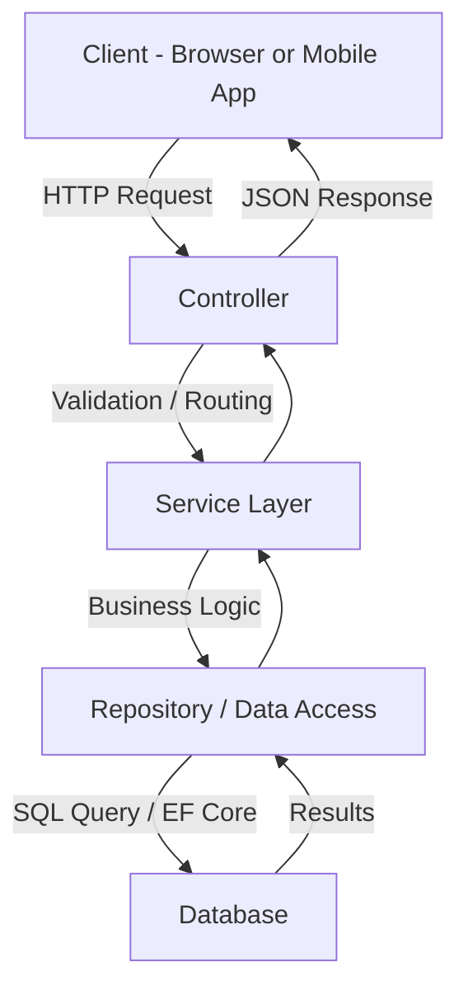

# APIs/webapi-csharp.md

# C# Web API Overview

**C# Web API** (ASP.NET Core Web API) is a widely used framework for building RESTful APIs in the .NET ecosystem. It enables developers to expose backend logic and data to clients such as Angular, React, or mobile apps.

---

## 🔹 Overview

* Part of **ASP.NET Core**, fully cross-platform and open-source.
* Allows building **RESTful APIs** with JSON, XML, or other formats.
* Integrates with **Entity Framework Core** for database access.
* Supports **middleware**, **dependency injection**, **logging**, **authentication**, and **authorization** out of the box.

---

## 🔹 Common Uses

* Backend services for **single-page applications (SPA)** like Angular or React.
* **Microservices** architecture for scalable distributed systems.
* **Serverless APIs** via Azure Functions or AWS Lambda (.NET support).
* Integration with **databases** (SQL Server, PostgreSQL, MySQL) or **external APIs**.
* **Authentication & Authorization** endpoints (JWT, OAuth, OpenID Connect).

---

## C# Web API Flow (ASP.NET Core)

> 🔑 **Explanation:**

- **Client** calls an endpoint (e.g., `GET /api/users`).
- **Controller** handles the request and delegates work.
- **Service Layer** applies business logic.
- **Repository/Data Access** talks to the database (via EF Core, Dapper, or raw SQL).
- **Response** flows back up the chain as JSON to the client.

---

## 🔹 Common Architectural Patterns

* **Dependency Injection (DI)**

  * Core to ASP.NET Core; inject services instead of hard-coding dependencies.
* **Repository Pattern**

  * Abstracts data access logic from business logic.
* **Unit of Work Pattern**

  * Ensures atomic operations across multiple repositories.
* **Factory Pattern**

  * Creates objects without exposing instantiation logic.
* **Mediator / CQRS**

  * Decouples commands/queries from handling logic for complex applications.
* **Middleware Pipeline**

  * Handles request/response processing (logging, authentication, error handling).

---

## 🔹 Best Practices for Folder Structure

```
/MyWebApi
│  Program.cs
│  Startup.cs
│  appsettings.json
│
├─ Controllers
│   └─ WeatherForecastController.cs
│
├─ Models
│   └─ WeatherForecast.cs
│
├─ Services
│   └─ WeatherService.cs
│
├─ Repositories
│   └─ WeatherRepository.cs
│
├─ Data
│   └─ AppDbContext.cs
│
├─ DTOs
│   └─ WeatherForecastDto.cs
│
├─ Mappings
│   └─ AutoMapperProfiles.cs
│
└─ Middleware
    └─ ExceptionMiddleware.cs
```

* **Controllers** → Handle HTTP requests.
* **Services** → Business logic.
* **Repositories** → Data access.
* **DTOs** → Data transfer objects.
* **Middleware** → Cross-cutting concerns (logging, error handling).

---

## 🔹 Code Flow Diagram

```
[ Client (Angular) ]
        |
        v
[ Controller ]
        |
        v
[ Service Layer ]
        |
        v
[ Repository / DbContext ]
        |
        v
[ Database (SQL Server / RDS / Cosmos) ]
```

* Client sends HTTP requests.
* Controller validates and forwards requests.
* Service layer contains business logic.
* Repository interacts with database.
* Response is returned through the same path back to the client.

---

## 🔹 Why It's Popular

* **Performance**: ASP.NET Core is lightweight and high-performance.
* **Cross-Platform**: Runs on Windows, Linux, and macOS.
* **Ecosystem**: Rich libraries, tooling (Visual Studio, VS Code), and strong community.
* **Security**: Built-in support for authentication, authorization, and secure headers.
* **Maintainability**: Encourages clean architecture, DI, and modular design.
* **Integration**: Works seamlessly with Azure, AWS, and various databases.

---

## 🔹 Additional Helpful Sections

* **Testing**: Unit tests with xUnit, integration tests with TestServer.
* **Logging & Monitoring**: Use Serilog, NLog, or Application Insights.
* **Versioning**: API versioning strategies (URL, header, query param).
* **Error Handling**: Centralized exception handling via middleware.

---

## 🔹 Summary

C# Web API (ASP.NET Core) is a robust, flexible, and high-performance framework for building backend services. It is ideal for modern web and mobile applications, supports multiple architectural patterns, and integrates well with various Azure and AWS services. Its popularity stems from strong performance, cross-platform support, security, and maintainability.
