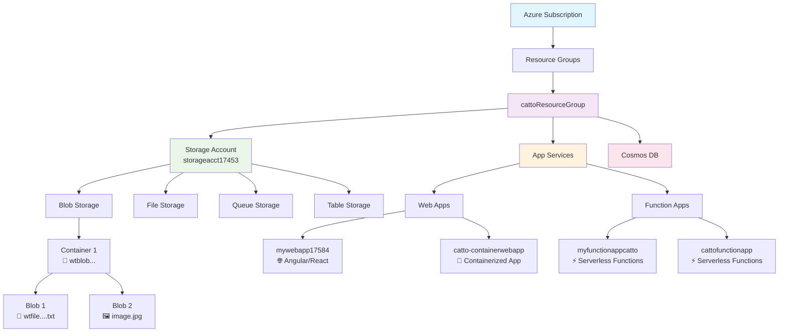

# 🏗️ Azure Services Hierarchy and Concepts

## 📊 Overall Azure Hierarchy

```
Azure Subscription
├── Resource Groups (logical containers)
    ├── Storage Accounts
    │   ├── Blob Storage (containers ≠ Docker containers!)
    │   ├── File Storage
    │   ├── Queue Storage
    │   └── Table Storage
    ├── App Services (web hosting)
    ├── Function Apps (serverless functions)
    ├── Cosmos DB (NoSQL database)
    ├── Virtual Machines
    └── Many other services...
```

---

## 🔍 Key Concept Clarifications

### ❌ Common Misconception
**Blob Storage "containers" ≠ Docker containers!**

- **Blob Storage Containers**: Just folders/buckets to organize your files (like AWS S3 buckets)
- **Docker Containers**: Packaged applications (these live in Azure Container Instances or App Services)

### ✅ Correct Understanding

**Storage Account → Blob Storage → Containers → Blobs (files)**
```
storageacct17453/
├── container1/
│   ├── file1.txt
│   └── image.jpg
└── container2/
    └── document.pdf
```

---

## 🎯 Main Azure Services You've Used

### 1. 📦 **Resource Groups**
- **What**: Logical containers that group related resources
- **Purpose**: Organization, access control, billing management
- **Example**: `cattoResourceGroup` contains all your related resources

### 2. 💾 **Storage Accounts**
- **What**: Contains all Azure Storage services
- **Children**: Blob, File, Queue, Table storage
- **Use Cases**: File storage, static websites, data lakes

### 3. 🌐 **App Services**
- **What**: Platform for hosting web applications
- **Supports**: .NET, Node.js, Python, PHP, Java, etc.
- **Use Cases**: Web apps, APIs, mobile backends
- **Examples**: Your `mywebapp17584`, `catto-containerwebapp`

### 4. ⚡ **Function Apps**
- **What**: Serverless compute service
- **Use Cases**: Event-driven code, microservices, automation
- **Examples**: Your `myfunctionappcatto`, `cattofunctionapp`

### 5. 🗄️ **Cosmos DB**
- **What**: Globally distributed NoSQL database
- **Use Cases**: High-scale applications, real-time apps

---

## 🤔 Your Specific Question: App Services vs Function Apps

You asked about seeing the same apps in both places. Here's what's happening:

### The Truth:
- **Function Apps ARE a type of App Service!**
- In the portal, you'll see them in both places because:
  - **"App Services"** shows ALL hosting services (Web Apps + Function Apps)
  - **"Function Apps"** shows ONLY Function Apps

### Your Apps Breakdown:
```
App Services (shows everything):
├── mywebapp17584 (Web App - for Angular/React)
├── catto-containerwebapp (Web App - containerized)
├── myfunctionappcatto (Function App - serverless)
└── cattofunctionapp (Function App - serverless)

Function Apps (subset of above):
├── myfunctionappcatto (same as above)
└── cattofunctionapp (same as above)
```

---

## 🎨 Visual Hierarchy



---

## 🎯 Service Use Cases Summary

| Service | Best For | Your Examples |
|---------|----------|---------------|
| **Storage Account** | Files, images, backups, static sites | `storageacct17453` |
| **Web App** | Frontend apps (Angular, React) | `mywebapp17584` |
| **Function App** | Backend APIs, automation, event handling | `myfunctionappcatto` |
| **Container App** | Dockerized applications | `catto-containerwebapp` |
| **Cosmos DB** | High-scale databases, real-time data | Your Cosmos DB instances |

---

## 📝 Azure Naming Conventions

### 🏷️ Microsoft Recommended Patterns

Azure follows this general pattern: `{resource-type}-{workload/app}-{environment}-{region}-{instance}`

### Common Service Naming Conventions

| Resource Type | Convention | Example | Your Current |
|---------------|------------|---------|--------------|
| **Resource Group** | `rg-{workload}-{env}-{region}` | `rg-ecommerce-prod-eastus` | ❌ `cattoResourceGroup` |
| **Storage Account** | `st{workload}{env}{region}{###}` | `stecommerceprodeus001` | ❌ `storageacct17453` |
| **Web App** | `app-{workload}-{env}-{region}-{###}` | `app-frontend-prod-eastus-001` | ❌ `mywebapp17584` |
| **Function App** | `func-{workload}-{env}-{region}-{###}` | `func-orderprocessing-prod-eastus-001` | ❌ `myfunctionappcatto` |
| **Cosmos DB** | `cosmos-{workload}-{env}-{region}` | `cosmos-userdata-prod-eastus` | ❌ Your Cosmos instances |
| **Container App** | `ca-{workload}-{env}-{region}-{###}` | `ca-api-prod-eastus-001` | ❌ `catto-containerwebapp` |

### 🎯 Best Practice Examples

**Better naming for your resources would be:**
```
Resource Group: rg-catto-dev-eastus
Storage Account: stcattodeveus001  
Web App: app-catto-frontend-dev-eastus-001
Function App: func-catto-api-dev-eastus-001
Cosmos DB: cosmos-catto-userdata-dev-eastus
```

### 📋 Naming Rules & Constraints

| Resource | Max Length | Allowed Characters | Case Sensitive |
|----------|------------|-------------------|----------------|
| Resource Group | 90 | Letters, numbers, periods, underscores, hyphens, parentheses | No |
| Storage Account | 24 | **Lowercase letters and numbers only** | No |
| App Service | 60 | Letters, numbers, hyphens | No |
| Function App | 60 | Letters, numbers, hyphens | No |
| Cosmos DB | 50 | Letters, numbers, hyphens | No |

### 🏢 Environment Abbreviations

| Environment | Abbreviation |
|-------------|--------------|
| Development | `dev` |
| Testing | `test` |
| Staging | `stage` |
| Production | `prod` |

### 🌍 Region Abbreviations

| Region | Abbreviation |
|--------|--------------|
| East US | `eus` |
| East US 2 | `eus2` |
| West US | `wus` |
| Central US | `cus` |

### 💡 Key Takeaways

1. **Resource Groups** = Folders for organizing resources
2. **Storage Containers** ≠ Docker containers (just file folders!)
3. **Function Apps** appear in both "App Services" and "Function Apps" sections
4. **App Services** is the umbrella term for web hosting in Azure
5. Each service has a specific purpose in your application architecture
6. **Consistent naming** makes resource management much easier at scale!

